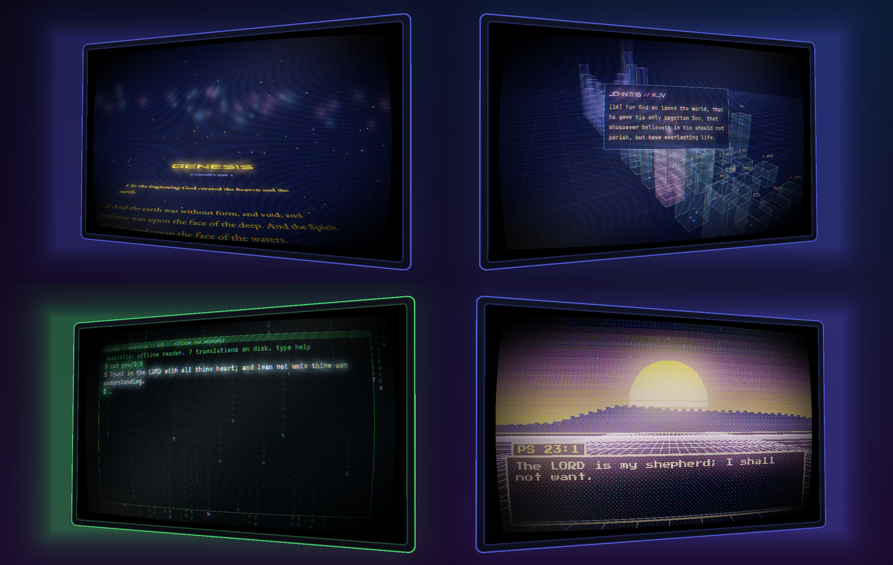

# Omabiblia



An offline Bible reader for Omarchy. You read on a floating 3D CRT screen, styled by your Omarchy theme, across five scenes with chiptune audio.

| # | Scene | What you see |
|---|---|---|
| 1 | **Crawl** | The chapter rolls away on a tilted plane into deep space, over a slowly turning starfield. |
| 2 | **Link** | A cyberspace grid to the horizon. The 66 books stand as wireframe data towers, height set by chapter count. The camera glides to the book you're reading and shows its verses on a holographic slab. |
| 3 | **Space Command** | A tactical display. The Old Testament is the inner orbit and the New Testament the outer one, with a radar sweep and a target lock on the current book. |
| 4 | **Hacker** | A phosphor terminal over digital rain made from the verse itself. The prompt is live: type `john 3:16`, `random`, `search love`, `tr bsb` or `help`. |
| 5 | **Retro** | A 320×200 synthwave sunset with parallax pixel mountains and a JRPG dialogue box that blips per letter, dithered to a chunky palette. |

## The screen
Every scene renders to a curved 3D CRT with bloom, scanlines, an aperture mask and chromatic aberration. It floats over your blurred Omarchy wallpaper and lights up the wallpaper around it.
- **Rotate:** drag with the mouse to turn it in depth, and use the wheel to zoom.
- **Cinematic swing:** **V** makes the screen swing on its own.
- **Flat mode:** **F** shows it as a plain 2D screen.

## Pop-out: the screen on your desktop
Press **P**, or launch **Omabiblia Pop-out**, to pop the 3D screen out of the window. It floats right on your desktop in a transparent, borderless Hyprland window.
- **Click-through:** only the monitor itself (and any open panel) takes clicks. Everything around it passes through to whatever is underneath.
- **Workspaces:** like the Scripture Scroll, it lives on the workspace you opened it on (Super+1, 2, 3 ...). Super+Shift+N moves it to another workspace, and Super+O (Omarchy's pop/pin) shows it on all of them.
- **Move and resize:** Super+drag moves it; resize it like any floating window.
- **Inside it:** drag rotates the screen in depth, V swings it, and P puts it back in the full view.
- **Setup:** `install.sh` adds the Hyprland rule for the `omabiblia-popout` app id (float, no border, shadow or blur, opacity 1). It backs up `hyprland.lua` first.

## Omarchy-dependent
Omabiblia reads the current Omarchy theme from `~/.local/state/omarchy/current/`: the colours in `theme/colors.toml`, the wallpaper in `background`, and the font from `omarchy-font-current`. It re-themes live when you switch themes.
- **Dark themes** dim the room so the screen glows.
- **Light themes** keep a light room around a deep screen.
- **Preview another theme** without switching Omarchy: `OMABIBLIA_THEME=hackerman omabiblia`.

## Translations (all offline)
| Code | Translation | Licence |
|---|---|---|
| KJV | King James Version (1769) | Public domain |
| WEB | World English Bible | Public domain |
| ASV | American Standard Version 1901 (the ancestor of the NASB) | Public domain |
| YLT | Young's Literal Translation | Public domain |
| BSB | Berean Standard Bible | Public domain since 2023 |
| LSV | Literal Standard Version | CC BY-SA 4.0. Attribution shows on screen while it is selected. |
| DBY | Darby | Public domain |

`tools/build_translations.py` rebuilds and verifies `data/`. Details are in `data/translations/NOTICE.md`.

**Not included:** NIV, NASB, NKJV, ESV and other copyrighted translations. They can't be redistributed.

## Privacy
There is no network code at all. Nothing you read leaves the machine. Settings are saved to `~/.config/omabiblia/omabiblia.ini`, and nothing else is written.

## Keys
| Key | Action |
|---|---|
| ← → | verse |
| ↑ ↓ | chapter |
| PgUp / PgDn | book |
| Tab / Shift+Tab | next / previous scene |
| 1–5 | scene (Ctrl+1–5 inside the terminal) |
| Space / R | random verse |
| T | verse of the day |
| C | whole chapter / single verse |
| B | books |
| / or Ctrl+F | search |
| N | next translation |
| M | music on/off |
| + / − | text size |
| V | cinematic swing |
| F | flat / 3D |
| P | pop out onto the desktop / back in |
| H | hide the bar |
| F11 | fullscreen |
| Esc | close panels |
| Ctrl+Q | quit |

## Download
Prebuilt Linux x86_64: grab `omabiblia-0.1.0-linux-x86_64.tar.gz` from [Releases](https://github.com/freeParameterized/omabiblia/releases), unpack it, and run `./run.sh`. It needs OpenGL 3.3 and Wayland or X11; no install step.

## Build and install
```sh
./install.sh            # builds, installs to ~/.local, adds "Omabiblia" to the Omarchy app launcher
# or by hand
cmake -S . -B build -DCMAKE_BUILD_TYPE=Release && cmake --build build -j6
./build/omabiblia [scene 1-5] [reference]      # e.g. ./build/omabiblia 3 psalm 23
```
- **Release builds:** add `-DOMA_DEV_SOURCE_DIR=OFF` so no local path is embedded.
- **Requirements:** a C++20 compiler, CMake, OpenGL 3.3, and the Wayland or X11 development headers.
- **Vendored:** GLFW 3.4, Dear ImGui 1.92, miniaudio, stb.

## Headless screenshots (no window shown)
```sh
./build/omabiblia --shot out.png --scene 2 --ref "john 3:16" [--chapter] [--size 1600x1000] [--seconds 5] [--yaw 0.5] [--ui] [--tr LSV] [--popout]
```

---
© 2026 Free Parameter LLC. **Open source under the Apache License 2.0**; see `LICENSE` and `NOTICE`. Third-party components and texts keep their own licences; see `THIRD_PARTY.md`. Contributions are welcome. Pull requests are accepted under the same licence.
